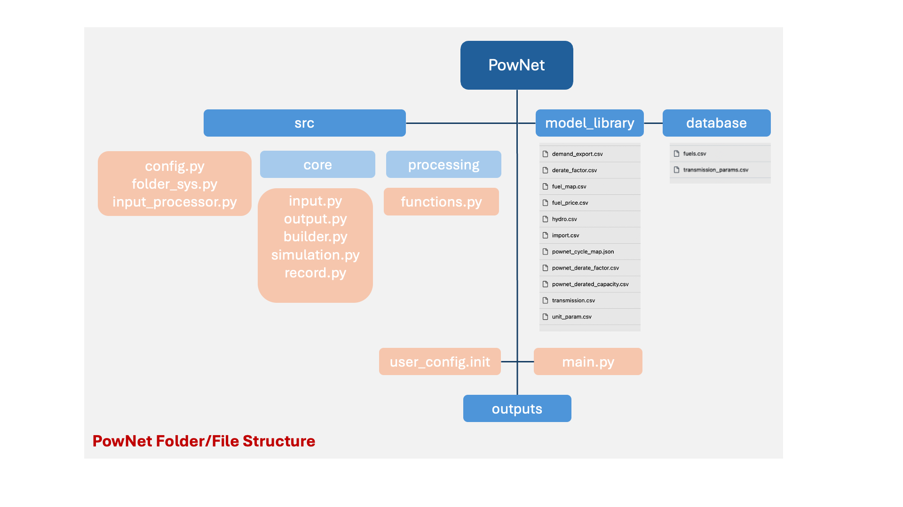

**3. Software Architecture**
============================

-----------------------
PowNet Folder Structure
-----------------------

The folder/files structure of PowNet is summarized as follows:

   

The user can make changes for the following options in ``main.py`` :

.. confval:: MODEL_NAME

    Define region of interest and year of simulation.

    :type: string
    :default: ``cambodia_2016``

.. code:: python

    MODEL_NAME='cambodia_2016'

.. confval:: use_gurobi

    Choose optimization solver: ``False``: use HiGHS solver and ``True``: use Gurobi solver.

    :type: boolean
    :default: ``False``

.. code:: python

   use_gurobi=False

.. confval:: T

    Define the simulation horizon.

    :type: integer
    :default: ``24``

.. confval:: STEPS

    Define the number of steps (number of days to run simulations).

    :type: integer
    :default: ``5``

.. confval:: Save_RESULT

    Choose to save results in ``outputs`` folder.

    :type: boolean
    :default: ``TRUE``

.. confval:: Save_PLOT

    Choose to save figures in ``outputs`` folder.

    :type: boolean
    :default: ``TRUE``

--------------
PowNet Scripts
--------------
..
.. list-table:: Brief Description of PowNet Scripts 
   :class: tight-table   
..

+--------------------------+-------------------------------------------------------------+
| Script                   | Description                                                 |
+==========================+=============================================================+
| input_processor.py       | Prepare the power system paramaters (saved under            |
|                          | “model_library” folder) for the region of interest.         |
|                          | It uses the following files to calculate parameters:        |
|                          |                                                             |
|                          | 1) transmission.csv                                         |
|                          |                                                             |
|                          | 2) transmission_params.csv                                  |
|                          |                                                             |
|                          | 3) unit_param.csv (needed for derate factor calculation)    |
|                          |                                                             |
|                          | 4) fuel_map.csv (needed for fuel price)                     |
+--------------------------+-------------------------------------------------------------+
| folder_sys.py            | Define the path of different folders (e.g., pownet          |
|                          | directory, inputs, outputs)                                 |
|                          |                                                             |
+--------------------------+-------------------------------------------------------------+
| config.py                | Read the configurations for PowNet and Gurobi from          |
|                          | “user_config.init”                                          |
|                          |                                                             |
+--------------------------+-------------------------------------------------------------+
| functions.py             | Contains functions to process user inputs including:        |
|                          |                                                             |
|                          | 1) get_dates()                                              |
|                          |                                                             |
|                          | 2) get_fuel_prices()                                        |
|                          |                                                             |
|                          | 3) create_init_condition()                                  |
|                          |                                                             |
|                          | 4) get_linecap()                                            |
+--------------------------+-------------------------------------------------------------+
| builder.py               | Contains “ModelBuilder” class to build the model by         |
|                          | adding unit commitment constraints [using equations         |
|                          | from Kneuven et al (2019)]                                  |
|                          |                                                             |
+--------------------------+-------------------------------------------------------------+
| input.py                 | Read the user inputs that define the power system           |
|                          | over one year including:                                    |
|                          |                                                             |
|                          | 1) demand_export.csv                                        |
|                          |                                                             |
|                          | 2) pownet_derate_factor.csv                                 |
|                          |                                                             |
|                          | 3) fuel_price.csv                                           |
+--------------------------+-------------------------------------------------------------+
| record.py                | Contains functions to record/write simulation               |
|                          | variables/outputs including:                                |
|                          |                                                             |
|                          | 1) write_df()                                               |
|                          |                                                             |
|                          | 2) SystemRecord.to_csv() [called by “simulation.py”]        |
+--------------------------+-------------------------------------------------------------+
| simulation.py            | Contains functions to run simulation including              |
|                          | “Simulator.run”                                             |
|                          |                                                             |
+--------------------------+-------------------------------------------------------------+
| output.py                | Contains functions to postprocess outputs and produce       |
|                          | plots including the following classes:                      |
|                          |                                                             |
|                          | 1) OutputProcessor                                          |
|                          |                                                             |
|                          | 2) Visulaizer                                               |
+--------------------------+-------------------------------------------------------------+

------------------
PowNet Input Files
------------------

+-----------------------------+---------------------------------------------------------------+
| File                        | Description                                                   |
+=============================+===============================================================+
| transmission.csv            | Techno-economic parameters of the transmission                | 	       
|                             | system. The user will need to specify columns                 | 
|                             | without the “pownet” prefix. Once a user has                  | 
|                             | specified the necessary columns, they need to                 |
|                             | run the transform_transmission_inputs function                | 
|                             | from input_processor.py to generate columns                   | 
|                             | with the “pownet” prefix.                                     |
|                             |                                                               |
+-----------------------------+---------------------------------------------------------------+
| unit_param.csv              | Techno-economic parameters of thermal generators              |
|                             |                                                               |
+-----------------------------+---------------------------------------------------------------+
| fuel_map.csv                | This file was used in the old version but no longer           |  
|                             | needed unless the user wants                                  |
|                             | to create ``fuel_price.csv`` with the                         |
|                             | ``create_fuelprice`` function from ``input_processor.py``.    |
|                             |                                                               |
+-----------------------------+---------------------------------------------------------------+
| fuel_price.csv              | Timeseries of fuel cost by generator. This file can be        |
|                             | generated with the ``create_fuelprice``                       |   
|                             | function from ``input_processor.py``.                         |
|                             |                                                               |
+-----------------------------+---------------------------------------------------------------+
| demand_export.csv           | Timeseries of electricity demand at each node.                |
|                             |                                                               |
+-----------------------------+---------------------------------------------------------------+
| hydro.csv                   | Timeseries of hydropower availability by node.                |
|                             |                                                               |
+-----------------------------+---------------------------------------------------------------+
| solar.csv                   | Timeseries of solar availability by node.                     |
|                             |                                                               |
+-----------------------------+---------------------------------------------------------------+
| wind.csv                    | Timeseries of wind availability by node.                      |
|                             |                                                               |
+-----------------------------+---------------------------------------------------------------+
| import.csv                  | Timeseries of import availability by node.                    |
|                             |                                                               |
+-----------------------------+---------------------------------------------------------------+
| pownet_cycle_map.json       | Created with ``create_cycle_map`` function from               |
|                             | ``input_processor.py``                                        |
|                             |                                                               |
+-----------------------------+---------------------------------------------------------------+
| pownet_derate_factor.csv    | Timeseries of the derating factor for each thermal generator. |
|                             | If there is no derating,                                      |
|                             | then the user can use the ``create_derate_factors`` from      |
|                             | ``input_processor.py`` to create the file.                    |
|                             |                                                               |
+-----------------------------+---------------------------------------------------------------+
| pownet_derated_capacity.csv | Timeseries of maximum capacity of thermal generators.         |
|                             | This file is created with the                                 |
|                             | ``create_derated_max_capacities`` from ``input_processor.py``.|
|                             |                                                               |
+-----------------------------+---------------------------------------------------------------+
| transmission_params.csv     | Techno-economic assumptions of the transmission               |
|                             | lines (the user does not need to modify this                  |    
|                             | file unless they want to customize transmission               |   
|                             | line parameters)                                              |
|                             |                                                               |
+-----------------------------+---------------------------------------------------------------+
| fuels.csv                   | Provides a list of color codes for different fuel types       |
|                             | for plotting purposes.                                        |
|                             |                                                               |
+-----------------------------+---------------------------------------------------------------+

--------------------
PowNet Output Files
--------------------

+---------------------------------------------------------------+---------------------------------------------+
| File                                                          | Description                                 |
+===============================================================+=============================================+
| YYYYMMDD_hhmm_laos_T_flow_variables.csv                       | Flow of electricity in the transmission     |
|                                                               | lines. Indexed with (source, sink, time)    |
|                                                               |                                             |
+---------------------------------------------------------------+---------------------------------------------+
| YYYYMMDD_hhmm_laos_T_node_variables.csv                       | hourly power values of different            |
|                                                               | power plants based on nodes type (vartype). |
|                                                               | Indexed with (node, time)                   |
|                                                               |                                             |
+---------------------------------------------------------------+---------------------------------------------+
| YYYYMMDD_hhmm_laos_T_system_variables.csv                     | System level variables, i.e. spinning       |
|                                                               | reserve. Indexed with (time).               |
|                                                               |                                             |
+---------------------------------------------------------------+---------------------------------------------+
| YYYYMMDD_hhmm_laos_fuelmix.png                                | Output figure showing the generation mix.   |
|                                                               |                                             |
+---------------------------------------------------------------+---------------------------------------------+
| YYYYMMDD_hhmm_unit_plots/YYYYMMDD_hhmm_laos_XXXXX.png         | Output figure showing the dispatch for      |
|                                                               | each thermal unit and the unit’s on/off     |
|                                                               | status.                                     |
|                                                               |                                             |
+---------------------------------------------------------------+---------------------------------------------+

