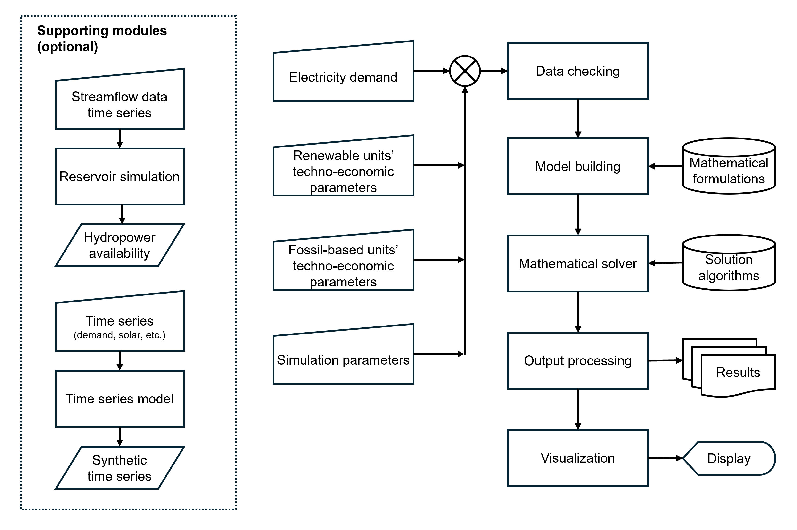

# Summary

Managing the complex network of power stations and transmission lines that deliver electricity across large spatial domains (e.g., country and continental scale) requires a variety of mathematical models. Among them, Production Cost Models (PCM) are commonly used for planning the short-term operation of power grids [@garver1962threebin]. Specifically, PCMs schedule the production of electricity by generators considering transmission constraints with planning horizons that range from a few hours to a few days. 

`PowNet 2.0` is a Python-based PCM framework that simulates and analyzes the most cost-effective way of meeting electricity demand using various electricity sources (e.g., coal, natural gas, and renewables) such that sufficient electricity is generated at each hour while considering factors like fuel prices, availability of renewables, and regulatory requirements. The framework also allows us to study the integration between hydropower and power systems.

The framework is designed to be accessible to a wide range of users, especially those with only basic Python knowledge. To use `PowNet 2.0`, a user can supply data for power stations, transmission lines, and electricity demand as spreadsheets, and run a script to handle the complex calculations and to produce modeling outputs as either data frames or spreadsheet files. While a basic user does not need to modify the codebase, an advanced user can leverage the software's flexible and modular design for more complex tasks, like modeling the interaction between water and power systems or exploring customized optimization algorithms.

# Statement of need

PCMs share similar features [@oikonomou2022core] and are widely used in both industry and academia. While proprietary options like `PLEXOS` and `PROMOD` offer comprehensive features and user-friendly interfaces, they do not follow the Findable, Accessible, Interoperable, and Reusable (FAIR) principles [@wilkinson2016fair], which help improve the transparency and applicability of models. Furthermore, the cost of proprietary PCMs can be prohibitive for many researchers and institutions. In response to these limitations, the open-source community has developed PCMs in various programming languages. A detailed taxonomy and comparison of different PCMs can be found in [@hoffmann2024review; @oberle2019open]. Notable examples include `SIENNA` [@lara2021pcm], written in Julia, and Python-based frameworks like `PyPSA` [@brown2017pypsa], `Grid Operations` [@akdemir2024open], and `PowNet` [@chowdhury2020pownet]. Building upon its predecessor, `PowNet 2.0` represents a significant leap forward, particularly as not all existing PCM frameworks have a full suite of features for addressing specific needs within the power systems domain, namely (1) the flexibility to incorporate diverse mathematical formulations and solution algorithms, (2) the capacity to generate stochastic input data (e.g., load, solar availability) to support uncertainty analyses, and (3) the ability to integrate hydropower and power system models. All these features are seamlessly integrated in our software.

`PowNet 2.0` has a few key functionalities that address the aforementioned needs: 

**Mathematical Formulations**: Selecting a set of computationally efficient mathematical formulations is an ongoing research effort [@tejada2019unit; @chen2022security]. The set of formulations implemented in `PowNet 2.0` was chosen based on thorough benchmarking exercises that compare the runtime of several different formulations [@horsch2018linear; @knueven2020mixed]. `PowNet 2.0` also allows a user to experiment with different formulations, such as representing the direct-current power flow with either the voltage-angle formulation or the Kirchhoff formulation.

**Solution Method**: `PowNet 2.0` supports both Gurobi and HiGHS as the mathematical solver. While Gurobi is a powerful commercial solver, its free usage is limited to an academic license. Consequently, HiGHs was chosen as an alternative due to its competitive performance among open-source solvers [@parzen2022opt]. A user can also explore solution methods like rounding heuristics [@bunnak2024bridging].

**Stochastic generation of input variables**: A user can automatically generate stochastic time series of load, solar, wind, and hydropower availability. These time series are created by the SARIMAX model, which requires as input deterministic time series. Through this functionality, the user can then explore the impact of uncertainty in weather and climatic conditions on power system performance. 

**Reservoir simulation**: The reservoir module simulates the operation of hydropower reservoirs, thus providing time series of available hydropower. It requires dam design specifications and inflow as input data. This feature makes the model more detailed, such as avoiding the use of static capacity factors, while reducing reliance on external hydrologic models.

**Water-power system coupling**: The reservoir simulation module can be either soft- or hard-coupled with the ‘core’ module simulating the unit commitment and economic dispatch problem. In the former case, the hydropower availability is passed as input (unidirectional information flow). In the latter case, the two modules are run in parallel, ensuring that dam release decisions follow the exact needs of the entire power system – representing a tighter integration between water and power systems [@koh2022hard].

# Software Design and Implementation

`PowNet 2.0` offers an end-to-end modeling framework through functionalities from generating synthetic time series of external forcings (e.g., load, solar, and wind availabilities) to plotting the modeling outputs. `PowNet 2.0` leverages the `Gurobipy` package for building instances of the optimization problem. This package was chosen because of its proven performance when compared to other Python-based modeling frameworks as shown in [@hofmann2023linopy; @gams2023perf]. Furthermore, `Gurobipy` allows a user to leverage the Python ecosystem by using popular libraries like `Pandas`, `SciPy`, and `NetworkX`.

The modeling workflow of `PowNet 2.0` is illustrated in \autoref{fig:workflow}. For each modeling task represented by a rectangle, there is a corresponding module to accomplish the task. This modular design facilitates unit testing of individual class objects and functions, ensuring code reliability and maintainability. It also enables future extension and customization, empowering users to adapt `PowNet 2.0` to their specific needs and contribute to its ongoing development. Current development efforts focus on modeling power purchase agreements, regional electricity trading schemes, and computational algorithms.

# Acknowledgement

Development of the reservoir module was supported by the US Department of Energy (DOE) Water Power Technologies Office as a part of the HydroWIRES “HydroCHiPPs” project (53165).

# References
