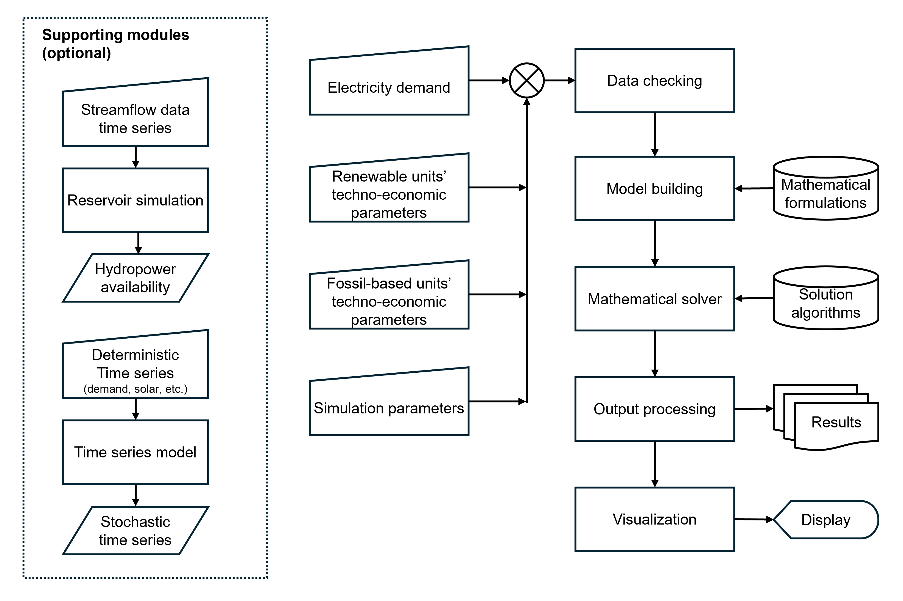

# Summary

Managing the complex network of power stations and transmission lines that deliver electricity across large spatial domains (e.g., country and continental scale) requires a variety of mathematical models, most of which are formulated as mathematical optimization problems. Production Cost Models (PCM) are among the most common types of models found in the power systems literature; their task is for planning the short-term operation of generators [@garver1962threebin]. In contrast to other power system models, PCMs thus employ a simpler representation of power flow and do not account for long-term investment decisions for system components. `PowNet 2.0` is a Python-based production cost modeling framework that simulates and analyzes the most cost-effective way of meeting electricity demand using various electricity sources (coal, natural gas, and renewables) such that sufficient electricity is generated at each hour while considering factors like fuel prices, availability of renewables, and regulatory requirements.

The framework is designed to be accessible to a wide range of users, especially those with only basic Python knowledge. To use `PowNet 2.0`, a user can supply data on power stations, transmission lines, and electricity demand as spreadsheets and run a script to handle the complex calculations and produce modeling outputs as either data frames or spreadsheet files. While a basic user does not need to touch the codebase, an advanced user can instead leverage the software’s flexible and modular design for complex tasks like modeling the interaction between water and power systems or exploring customized algorithms.

# Statement of need

PCMs share similar features [@oikonomou2022core] and are widely used in both industry and academia. While proprietary options like `PLEXOS` and `PROMOD` offer comprehensive features and user-friendly interfaces, they do not follow the Findable, Accessible, Interoperable, and Reusable (FAIR) principles [@wilkinson2016fair ], which help us improve the transparency and applicability of models. Furthermore, the cost of proprietary PCMs can be prohibitive for many researchers and institutions. In response to these limitations, the open-source community has developed PCMs in various programming languages. Notable examples include `SIENNA`[@lara2021pcm], written in Julia, and Python-based frameworks like `PyPSA` [@brown2017pypsa],  `Grid Operations`[@akdemir2024open], and `PowNet`[@chowdhury2020pownet]. A detailed taxonomy and comparison of different PCMs can be found in [@hoffmann2024review, @oberle2019open].

However, not all existing PCM frameworks have a full suite of features for addressing specific needs within the power systems domain: (1) the ability to efficiently handle large-scale systems with numerous nodes and edges, (2) the flexibility to incorporate diverse mathematical formulations and solution algorithms, (3) the capacity to generate stochastic input data for uncertainty analysis, and (4) the seamless integration of these functionalities.

`PowNet 2.0` is specifically designed to run multiple simulations of large-scale power systems. While sharing a similar name, `PowNet 2.0` represents a significant advancement over its predecessor, `PowNet`. Specifically, the new software has several desirable features that address the aforementioned needs: 

**Modeling Framework**: `PowNet 2.0` leverages the Gurobipy package for building instances of the optimization problem. Gurobipy has a proven performance when compared to other Python-based modeling frameworks as shown in [@hofmann2023linopy, @gams2023perf]. Furthermore, Gurobipy allows a user to leverage the Python ecosystem by using popular libraries like Pandas, SciPy, and NetworkX.

**Mathematical Formulations**:  Selecting a set of computationally efficient mathematical formulations is an on-going research [@tejada2019unit, @chen2022security]. The set of formulations implemented in `PowNet 2.0` was chosen based on thorough benchmarking exercises that compare the runtime of several different formulations [@knueven2020mixed, @horsch2018linear]. `PowNet 2.0` also allows a user to experiment with different formulations, such as representing the direct-current power flow with either the voltage-angle formulation or the Kirchhoff formulation.

**Solution Method**: `PowNet 2.0` supports both Gurobi and HiGHS as the mathematical solver. While Gurobi is a powerful commercial solver, its free usage is limited to an academic license. Consequently, HiGHs was chosen as an alternative due to its competitive performance among open-source solvers [@parzen2022opt]. Furthermore, a user can also explore solution methods like rounding heuristics [@bunnak2024bridging].

**Stochastic generation of input variables**: A user can automatically generate stochastic time series given a historical time series. Through this functionality, the user can then explore the impact of weather and climate on power system performance. 

**Reservoir simulation**: A reservoir module simulates the operation of a cascade of reservoirs. This allows for a detailed modeling of hydropower availability given inflow data.

# Software Design, Implementation, and Validation

`PowNet 2.0` offers an end-to-end modeling framework through functionalities from generating synthetic time series to plotting the modeling outputs. The software is specifically designed to support power-water systems coupling, featuring a reservoir simulation module and the ability to modify modeling inputs at each simulation timestep. 

The modeling workflow of `PowNet 2.0` is illustrated in Figure\autoref{fig:workflow}. For each modeling task represented by a rectangle, there is a corresponding module to accomplish the task. This modular design facilitates unit testing of individual class objects and functions, ensuring code reliability and maintainability. It also enables future extension and customization, empowering users to adapt `PowNet 2.0` to their specific research needs and contribute to its ongoing development.

# References
